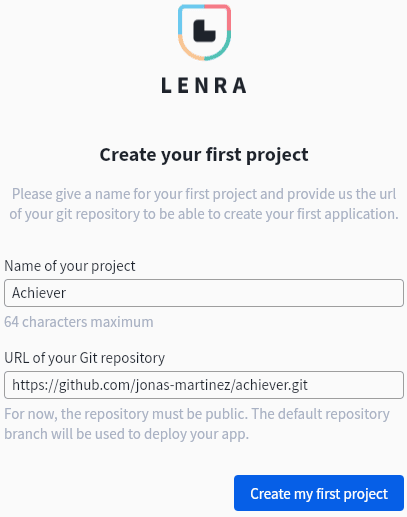

# Getting Started

## How to start a new Lenra project

It is very easy to start a new Lenra project. The most important thing for you is to choose your favorite programming language with which you will be developing your application.
Choose one in [the template list](https://github.com/orgs/lenra-io/repositories?q=&type=template&language=&sort=stargazers) that will be used as a starting point for your application. 

You then need to run the following command using the Lenra CLI to create your new project using the template of your choice. See the next example using the **template-node** template:

```console
lenra new node my-app
```


Now that your app is ready you can use the Lenra CLI to get started faster, using the devtools.

For installation instructions, you can directly check the cli repository : https://github.com/lenra-io/lenra_cli

Using the CLI you first need to build your application.

```console
lenra build
```

Then your application can be started.

```console
lenra start
```

## Deploy the hello world example to the online platform

When your application is ready to be shared with others you might find interest into deploying it to the online platform.

Create an account on [dev.lenra.io](http://dev.lenra.io). You will be asked for a token to join our developer platform, we will be sending you one as soon as possible. After successfully completing this step you will be redirected to the creation of your first project, just enter a name and the URL of the github repository that you created at the beginning of this documentation.



Then you will have to click `Publish my application` at the top right corner, your application will be sent to Lenra's servers and deployed to be accessible directly for the Lenra Store. Once your application is fully deployed on our servers, it will be accessible by clicking the `See my application` button. You can share this application by changing its visibility to `public` in the settings and sending the link to people (which should look close to app.lenra.io/#/app/f6279d6a-3b71-4520-a7f8-0f7b28700de9).