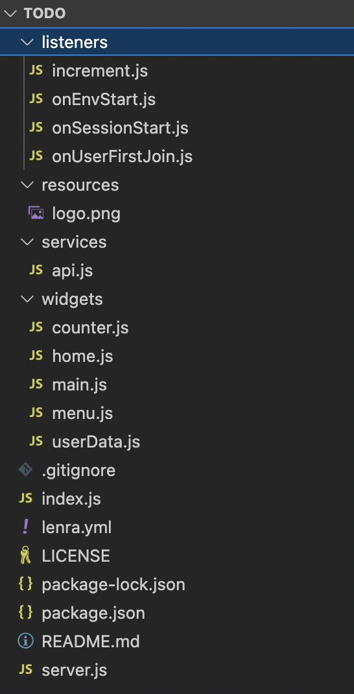
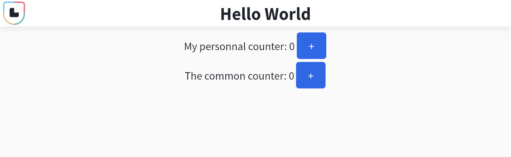

## Prerequisites

## General requirements

First of all, you have to install [git](https://git-scm.com/book/en/v2/Getting-Started-Installing-Git) and [docker](https://docs.docker.com/engine/install/) on your computer.

## Install Lenra CLI using [**cargo**](https://doc.rust-lang.org/cargo/getting-started/installation.html)

Simply install the latest package using the cargo-cli

```bash
cargo install lenra_cli@version
```

For more installation instructions, you can directly check the CLI repository : [https://github.com/lenra-io/lenra_cli](https://github.com/lenra-io/lenra_cli).


## Install Lenra CLI using the binary

**[Download the latest binary](https://github.com/lenra-io/lenra_cli/releases)**, unpack it where you want and update your $PATH

```bash
export PATH="/my/path/to/lenra_cli:$PATH"
```
<figcaption align="left" style="margin-top: -13px; margin-bottom: 13px; color: gray; font-size: 0.9em;">in your .bashrc, .zshrc…</figcaption>


# Create a new lenra project

To create a new lenra project you can just run the `lenra new` command.

This command takes two parameters : The **template name** ([see list of templates](https://github.com/orgs/lenra-io/repositories?q=&type=template&language=&sort=stargazers)) and the **project name**.

```bash
lenra new javascript todo
cd todo
```

> Note : All the guides in this documentation will focus on the javascript template (using javascript). Other languages work about the same and main principles remain the same too. **Don't be afraid to follow these guides using another language !**

## Directory structure

First of all, we can see that this project is already versioned with git. This is a usually a good idea to commit your changes early on. This new project is a simple app that showcases a simple counter app.

About the different files : 

<p align="center">
    
</p>

- `.package.json`  Add your project dependency in this file like any other node project
- `listeners/*.js` are the listeners of this project. A listener is a piece of code that will be executed when a specific action occurs. More on this later.
- `services/*.js` are modules that take care of sending API calls to Lenra. This will be helpful to create/update/delete data from the database.
- `views/*.js` are the UI parts of the application. These views can be combined to create complex UI.
- `resources/*.js` are the images and other resources you need to access from the UI.
- `index.js` is the manifest where you will register your views and listeners, create your routes etc..
- `server.js` is the webserver that will take care of the interactions with the lenra back-end. **Do not update this file if you don’t know what you are doing !**
- `lenra.yml` is a file that explains to the lenra CLI how to build your app. If you create a complex app that needs other steps to be built and/or started, you will need to edit this file.

## Build and start

To build and start the app, you just need to run this command :

```bash
lenra dev
```

This command will use the `lenra.yml` file to create a docker image of your app. It also creates the `.lenra` directory that will contain all the temporary files that will be needed to start your project locally. Then it will start your app with an interactive terminal.

When everything is correctly started, you should be able to open your app in your browser at [http://localhost:4000](http://localhost:4000) !

<p align="center">
    
    <figcaption align="left" style="margin-top: -13px; margin-bottom: 13px; color: gray; font-size: 0.9em;">You are ready to use Lenra !</figcaption>
</p>


# Deploy your app

When your application is ready to be shared with others you might find interest into deploying it to the online platform.

Create an account on [dev.lenra.io](http://dev.lenra.io).
You will be asked for a token to join our developer platform as our platform is in private beta phase.
We will be sending you one as soon as possible.
After successfully completing this step you will be redirected to the creation of your first project, just enter a name and the URL of the app git repository.

<p align="center">
    
</p>
Then you simply click `Publish my application` at the top right corner, your application will be sent to Lenra's servers and deployed to be accessible directly for the Lenra Store. 
Once your application is fully deployed on our servers, it will be accessible by clicking the `See my application` button. 
You can share this application by changing its visibility to `public` in the settings and sending the link to people (which should look close to app.lenra.io/#/app/f6279d6a-3b71-4520-a7f8-0f7b28700de9).

