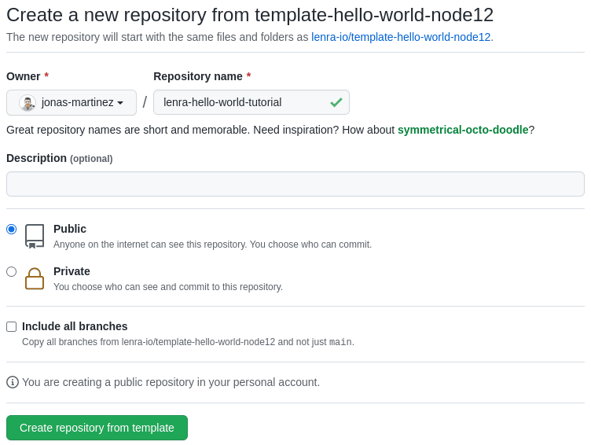

# Getting Started

## How to start a new Lenra project

It is very easy to start a new Lenra project. The most important thing for you is to choose your favorite programming language with which you will be developing your application. For the moment we only provide node12 but much more will come in the future.

The next step is to choose a template that will be used as a starting point for your application. We made one specifically for node12 that can be found [here](https://github.com/lenra-io/template-hello-world-node12). You can use this template to create a new github project specifically for your application as shown in the image below.



Then, clone this newly created repository by running the following command. Make sure to change the URL to match your github username and project name.

```console
git clone https://github.com/jonas-martinez/lenra-hello-world-template.git
```

Now that your app is ready you have the choice between using the devtools to get your app running locally or deploy it to the online platform to share it with other users.

## Start and use the devtools

The devtools are a way to run and debug your application locally, there is a specific version of the devtools for each language that Lenra supports. In your case if you followed the instructions above, you need to run the `devtools-node12`.

Go to your application folder and use our devtools docker image by running the following command.

```bash
docker run -it --rm -p 4000:4000 -v "${PWD}:/home/app/function" lenra/devtools-node12:beta
```

You can now access the <a href="http://localhost:4000/" target="_blank" rel="noopener">Devtools</a> to test your app.

## Deploy the hello world example to the online platform